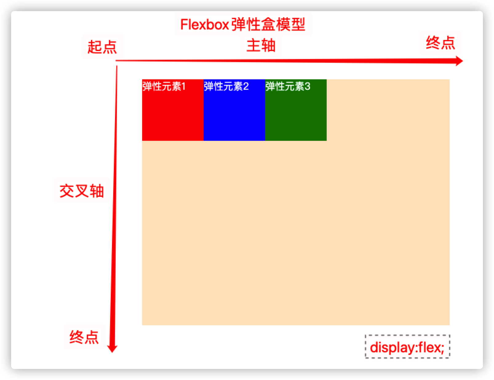
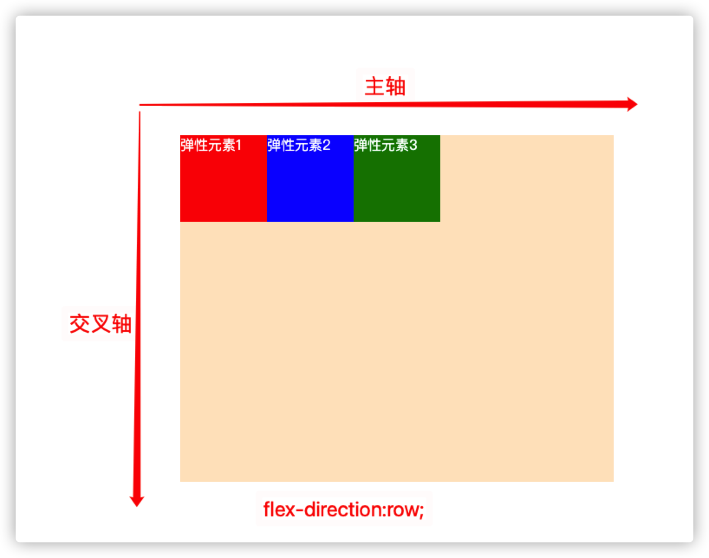
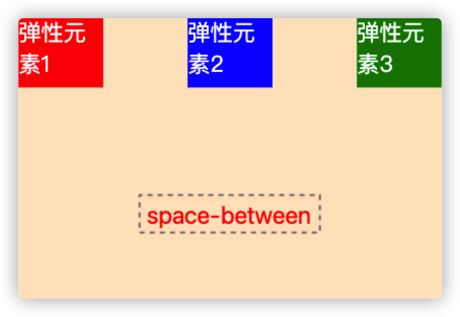
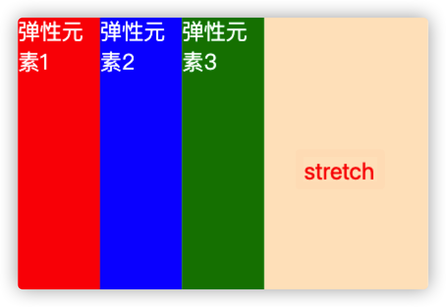
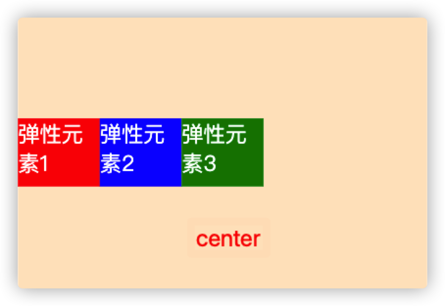
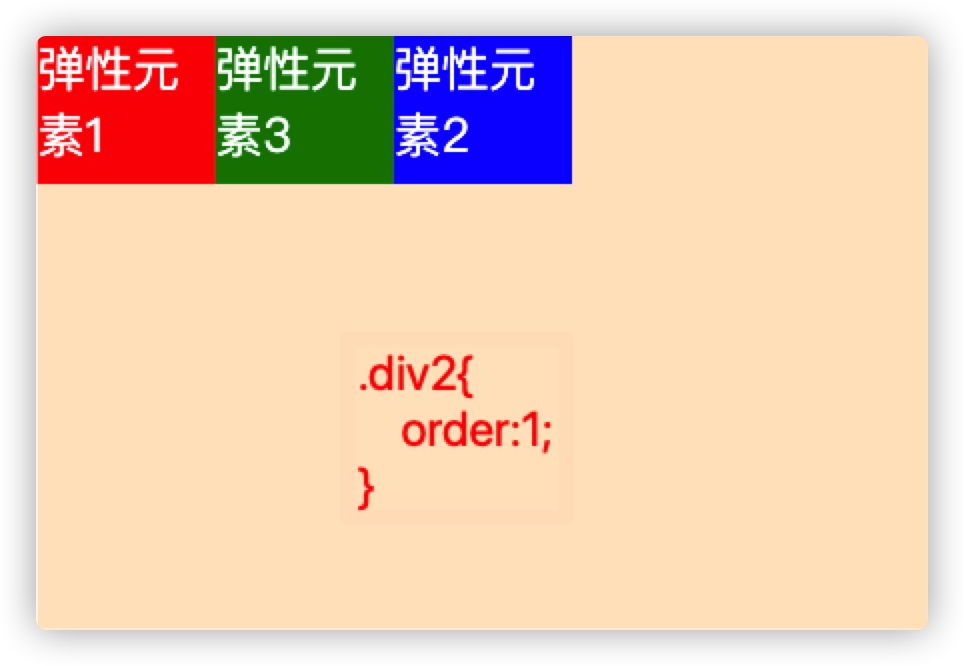
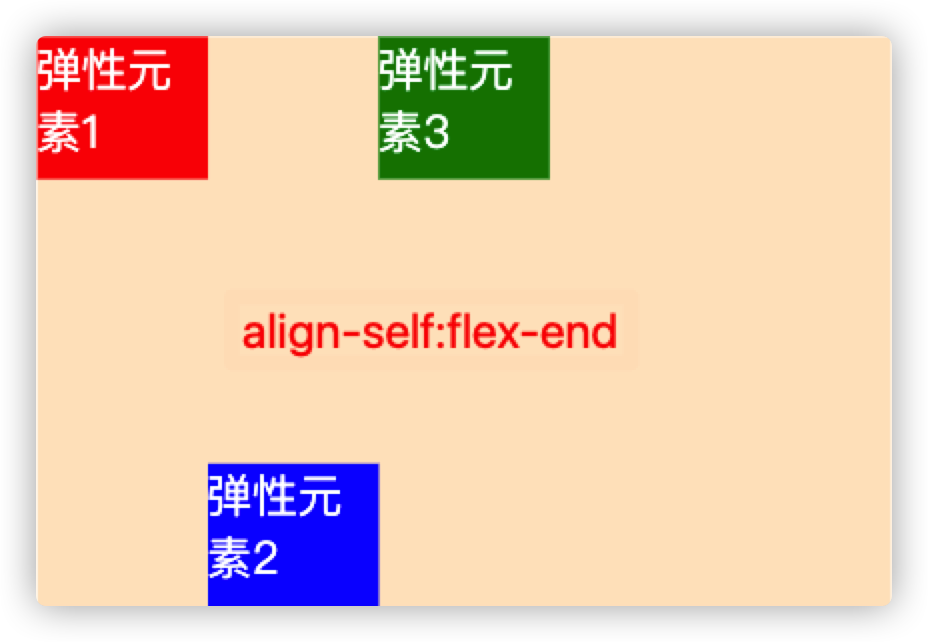

## 1.flex布局

​	布局的传统解决方案，基于盒模型，依赖 display 属性 + position属性 + float属性。它对于那些特殊布局非常不方便，比如，垂直居中就不容易实现。

​	2009年，W3C 提出了一种新的方案----Flex 布局，可以简便、完整、响应式地实现各种页面布局。目前，它已经得到了所有浏览器的支持，这意味着，现在就能很安全地使用这项功能。

​	Flex 是 Flexible Box 的缩写，意为"弹性布局"，用来为盒状模型提供最大的灵活性。

​	任何一个容器都可以指定为 Flex 布局。

## 2.flex布局属性

> #### 容器属性
>
> - flex-flow
> - flex-direction
> - flex-wrap
> - justify-content
> - align-items
> - align-content
>
> #### 元素属性
>
> - order
> - flex-grow
> - flex-shrink
> - flex-basis
> - flex
> - align-self

## 3.flex弹性盒模型

​	采用 Flex 布局的元素，称为 Flex 容器（flex container），简称"容器"。它的所有子元素自动成为容器成员，称为 Flex 项目（flex item），简称"项目"。

​	对于某个元素只要声明了`display: flex;`，那么这个元素就成为了弹性容器，具有flex弹性布局的特性。



1. 每个弹性容器都有两根轴：**主轴和交叉轴**，两轴之间成90度关系。注意：**水平的不一定就是主轴。**
2. 每根轴都有**起点和终点**，这对于元素的对齐非常重要。 
3. 弹性容器中的所有子元素称为<弹性元素>，**弹性元素永远沿主轴排列**。
4. 弹性元素也可以通过`display:flex`设置为另一个弹性容器，形成嵌套关系。因此**一个元素既可以是弹性容器也可以是弹性元素**。

弹性容器的两根轴非常重要，所有属性都是作用于轴的。

#### 3.1.主轴

flex布局是一种**一维布局**模型，一次只能处理一个维度（一行或者一列）上的元素布局。

也就是说，**flex布局大部分的属性都是作用于主轴的，在交叉轴上很多时候只能被动地变化**。

我们可以在弹性容器上通过`flex-direction`修改主轴的方向。如果主轴方向修改了，那么：

1. 交叉轴就会相应地旋转90度。
2. 弹性元素的排列方式也会发生改变，因为**弹性元素永远沿主轴排列**。

**flex-direction属性**

取值：row(默认) | row-reverse | column | column-reverse

用于控制项目排列方向与顺序，默认row，即横向排列，项目排列顺序为正序1-2-3；row-reverse同为横向排列，但项目顺序为倒序3-2-1。

column 与row相反，为纵向排列，项目顺序为正序1-2-3，column-reverse同为纵向排列，项目顺序为倒序3-2-1。



#### 3.2.沿主轴的排列处理

弹性元素永远沿主轴排列，那么如果主轴排不下，该如何处理？

通过设置**flex-wrap属性**可使得主轴上的元素不换行、换行、反向换行。

取值：nowrap(默认) | wrap | wrap-reverse

用于控制项目是否换行，nowrap表示不换行；

举个例子：比如容器宽度为300px，容器中有6个宽度为60px的元素，nowrap情况下，项目会强行等分容器宽度从而不换行，那么项目实际宽度也就只有50px了，而非我们自己设置的60px。


wrap表示换行，即项目不会等分容器宽度，而是根据自身宽度进行排列，如果超出父容器宽度则自然换行。


wrap-reverse同样表示换行，需要注意的是第一排会紧贴容器底部，而不是我们想象的项目6紧贴容器顶部，效果与wrap相反。


#### 3.3.flex-flow属性

flex-flow属性是flex-deriction与flex-wrap属性的简写集合，默认属性为row nowrap，即横向排列，且不换行，如果需要控制项目排列与换行，推荐使用此属性，而非单独写两个。

#### 3.4.justify-content属性

取值：flex-start(默认) | flex-end | center | space-between | space-around | space-evenly;

用于控制项目在主轴的对齐方式，默认flex-start即左对齐，center 为居中，对应的flex-end为右对齐。


space-between为左右两端对齐，即左右两侧项目都紧贴容器，且项目之间间距相等。



space-around为项目之间间距为左右两侧项目到容器间距的2倍，比较特别的布局，日常使用不太多。


space-evenly为项目之间间距与项目与容器间距相等，相当于除去项目宽度，平均分配了剩余宽度作为项目左右margin。


####  3.5.align-items属性

取值：flex-start | flex-end | center | baseline | stretch(默认)

用于控制项目在交叉轴排列方式，默认stretch即如果项目没设置高度，或高度为auto，则占满整个容器，下面第一张图的项目没设置高度，其余均为50px。



flex-start会让项目在交叉轴紧贴容器顶部，flex-end与之相反：


center使用最多，自然不会陌生，在交叉轴中心位置排列：



baseline比较特殊，它让项目以第一行文字的基线为参照进行排列：


注意，常理来说justify-content与align-items默认分别处理项目主轴，交叉轴的对齐方式，但如果我们修改了flex-direction为column，它们处理的轴向会交换，也就是justify-content处理交叉轴，align-items处理主轴。

想要使一个子元素垂直水平居中，只需要设置其父元素

```css
justify-content: center; /* 水平居中 */
align-items: center;     /* 垂直居中 */
```

#### 3.6.align-content

取值：flex-start | flex-end | center | space-between | space-around | space-evenly | stretch(默认);

用于控制多行项目的对齐方式，如果项目只有一行则不会起作用，需设置flex-wrap: wrap；默认stretch，即在项目没设置高度，或高度为auto情况下让项目填满整个容器，与align-items类似。注意，如下演示的12个项目均没有设置高度。


flex-start ，center，flex-end 与align-items属性表现一致：


space-around与justify-content保持一致，即项目之间间距为上下两端项目与容器间距两倍。


space-evenly同理，项目之间间距与项目到容器之间间距相等，space-between为上下两侧项目紧贴容器。


### 项目属性

介绍完容器属性，简单介绍下项目属性。容器属性是加在容器上的，那么项目属性呢，就是写在项目上的，就好比容器属性给ul，项目属性给li差不多一个意思。

#### 3.8.order

取值：默认0，用于决定项目排列顺序，数值越小，项目排列越靠前。



#### **3.9.flex-grow**

取值：默认0，用于决定项目在有剩余空间的情况下是否放大，默认不放大；注意，即便设置了固定宽度，也会放大。

假设默认三个项目中前两个个项目都是0，最后一个是1，最后的项目会占满剩余所有空间。


假设只有第一个项目默认为0，后面两个项目flex-grow均为1，那么后两个项目平分剩余空间。


假设第一个项目默认为0，第二个项目为flex-grow:2，最后一个项目为1，则第二个项目在放大时所占空间是最后项目的两倍。


#### **3.10.flex-shrink**

取值：默认1，用于决定项目在空间不足时是否缩小，默认项目都是1，即空间不足时大家一起等比缩小；注意，即便设置了固定宽度，也会缩小。

但如果某个项目flex-shrink设置为0，则即便空间不够，自身也不缩小。


上图中第二个项目flex-shrink为0，所以自身不会缩小。

#### **3.11.flex-basis**

取值：默认auto，用于设置项目宽度，默认auto时，项目会保持默认宽度，或者以width为自身的宽度，但如果设置了flex-basis，权重会比width属性高，因此会覆盖widtn属性。


```css
div{
  flex-basis: 80px;
  width: 60px;
  height: 50px;
  color: white;
}
```

上图中先设置了flex-basis属性，后设置了width属性，但宽度依旧以flex-basis属性为准。

#### **3.12.flex**

取值：默认0 1 auto，flex属性是flex-grow，flex-shrink与flex-basis三个属性的简写，用于定义项目放大，缩小与宽度。

该属性有两个快捷键值，分别是auto(1 1 auto)等分放大缩小，与none(0 0 auto)不放大不缩小。

还有最常用的flex:1 === flex: 1 1 0px

#### **3.13.align-self**

取值：auto(默认) | flex-start | flex-end | center | baseline | stretch，表示继承父容器的align-items属性。如果没父元素，则默认stretch。

用于让个别项目拥有与其它项目不同的对齐方式，各值的表现与父容器的align-items属性完全一致。

